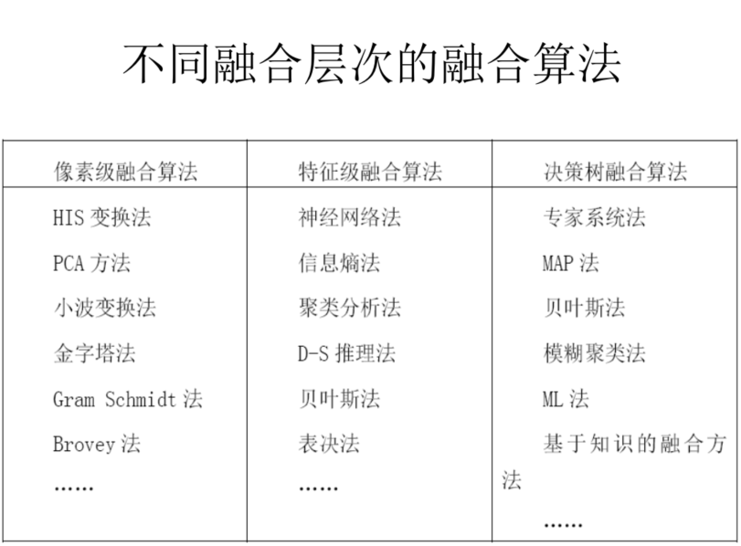

## 多源遥感图像融合

### 为什么要融合？

  因为遥感图像有多种来源，其获取的**空间、时间、波谱、图像分辨率**都不一定相同。为了充分利用和开发多源遥感数据图像，提取更丰富更全面的信息，遥感图像融合应运而生。
  
### 遥感器图像类型

  全色图像、多光谱图像、红外、SAR、高光谱
  
### 融合的定义
  
  将配准后的同一地区的不同类型的遥感图像采用一定的算法，将各图像中所包含互补性信息有机的结合起来，生成新图像的技术。（2变1或者多变一） 融合后的图像能够把多种图像数据有机互补，使图像在**清晰度、空间分辨率和光谱信息**等有很大提高，从而改善分类精度，增强变化检测能力。
 
### 融合类型

  同源融合、异源融合  
  （最典型应用：全色（灰度图像、高分辨率）+多光谱）
  
### 融合基本流程 

  两景或多景图像->几何校正/配准->(基于像元的图像融合/基于特征的图像融合/决策级的图像融合)->融合图像的评价和应用
  
### 像素级融合

  融合后图像像素内容准确丰富，地物轮廓信息表达准确，特征信息也更丰富，目标特征更容易识别
  
  1.对图像的空间分辨率要求较高，融合后保留细节信息较多，融合后图像相对原始数据有所提升。
  
  2.像素级融合保留了尽可能多信息，融合结果有较高的精度，但是处理信息量大，耗时长，实时性差。
  
  3.目前，图像融合算法的研究主要集中在像素层。
  
### 特征级图像融合

  是指通过不同算法对不同数据源数据进行基于目标的**特征提取**，如**边缘提取或分类**，从原始图像上提取特征信息后对这些信息通过统计方法、神经网络、Kalman滤波、相关聚类等算法进行融合处理的过程。
  1.实现客观的信息压缩，便于实时处理；所提供的特征直接与决策分析相关，因此，融合结果最大限度的给出了决策分析所需要的特征信息。
  
  2.缺点是比像素级融合精度差
  
### 决策级图像融合
  最高级别的融合处理，直接面向应用，为决策提供服务。决策级的融合首先对源数据进行处理，经过判断得到识别，根据结果应用一定的准则和协调单个数据源决策的可信度来得到最优化的决策结果。
  
  1.既融合了有价值的信息，又得到了综合决策的结果，提高了识别解译能力
  
  2.有很好的容错性和很好的可改性，处理时间短
  
  3.图像信息损失大
  
### 不同融合层次的融合算法

