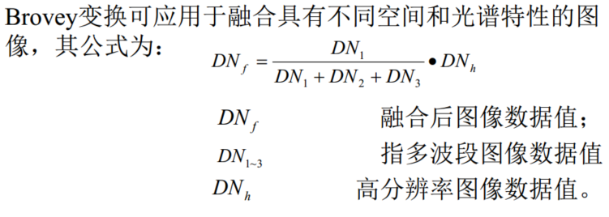
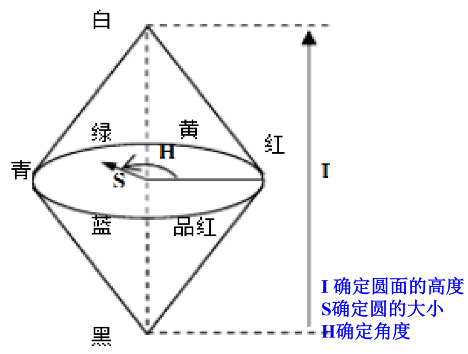

## 多源遥感图像融合

### 为什么要融合？

  因为遥感图像有多种来源，其获取的**空间、时间、波谱、图像分辨率**都不一定相同。为了充分利用和开发多源遥感数据图像，提取更丰富更全面的信息，遥感图像融合应运而生。
  
### 遥感器图像类型

  全色图像、多光谱图像、红外、SAR、高光谱
  
### 融合的定义
  
  将配准后的同一地区的不同类型的遥感图像采用一定的算法，将各图像中所包含互补性信息有机的结合起来，生成新图像的技术。（2变1或者多变一） 融合后的图像能够把多种图像数据有机互补，使图像在**清晰度、空间分辨率和光谱信息**等有很大提高，从而改善分类精度，增强变化检测能力。
 
### 融合类型

  同源融合、异源融合  
  （最典型应用：全色（灰度图像、高分辨率）+多光谱）
  
### 融合基本流程 

  两景或多景图像->几何校正/配准->(基于像元的图像融合/基于特征的图像融合/决策级的图像融合)->融合图像的评价和应用
  
### 像素级融合的特点

  融合后图像像素内容准确丰富，地物轮廓信息表达准确，特征信息也更丰富，目标特征更容易识别
  
  1.对图像的空间分辨率要求较高，融合后保留细节信息较多，融合后图像相对原始数据有所提升。
  
  2.像素级融合保留了尽可能多信息，融合结果有较高的精度，但是处理信息量大，耗时长，实时性差。
  
  3.目前，图像融合算法的研究主要集中在像素层。
  
### 特征级图像融合的特点

  是指通过不同算法对不同数据源数据进行基于目标的**特征提取**，如**边缘提取或分类**，从原始图像上提取特征信息后对这些信息通过统计方法、神经网络、Kalman滤波、相关聚类等算法进行融合处理的过程。
  
  1.实现客观的信息压缩，便于实时处理；所提供的特征直接与决策分析相关，因此，融合结果最大限度的给出了决策分析所需要的特征信息。
  
  2.缺点是比像素级融合精度差
  
### 决策级图像融合的特点
  最高级别的融合处理，直接面向应用，为决策提供服务。决策级的融合首先对源数据进行处理，经过判断得到识别，根据结果应用一定的准则和协调单个数据源决策的可信度来得到最优化的决策结果。
  
  1.既融合了有价值的信息，又得到了综合决策的结果，提高了识别解译能力
  
  2.有很好的容错性和很好的可改性，处理时间短
  
  3.图像信息损失大
  
### 不同融合层次的融合算法

### 基于显示的像素级融合

- 典型：全色+多光谱融合

- Brovey变换融合：归一化后的多光谱波段与高分辨率图像（全色）相乘来增强图像信息。

- 公式：

- HIS模型

  包含色调（H）、饱和度（S）、亮度（I），其中色调和饱和度统称色度，颜色也用亮度和色度表示，图像彩色信息包含在色度中，与亮度分类分离。
  
  色彩信息与亮度信息相分离， 亮度的变化独立于色彩信息，是IHS色彩空间的优点。对亮度分量进行改变时，只会使图像变得更暗或者更亮，而不会影响图像的色度和饱和度。
  
  HSI模型使用双圆锥表示，I是强度轴，H变化范围[0,2pi]，S是颜色空间任意一点局I轴的距离。
  

- RGB颜色模型

  在计算机领域中进行色彩处理是用RGB 来表示的。但在在人眼视觉中通常应用彼此间不相关的HIS模型来表征色彩。
  
- HSI融合变换步骤

  1.将低分辨率的多光谱图像从RGB色彩空间变换到HIS空间，得到I、S、H三个独立的分量
  
  2.将高分辨率图像与I分量进行直方图匹配，使两者具有相近的灰度变化范围
  
  3.将直方图匹配后的高分辨率全色图像替换多光谱图像I分量，加上原来的H、S分量，进行HIS反变换，即可得到融合多光谱图像
  
  4.正变换（HIS->RGB）(一种方法)
  - I = R + G + B
  - H = (G-B) / (I - 3B)
  - S = (I - 3B) / I
  
  5.反变换（RGB->HIS）
  由于高空间分辨率图像和多光谱图像三个波段的相关性较低，因此直接用高空间分辨率图像替换HIS变换的I分量会导致融合图像出现严重的光谱失真。

- PCA变换融合算法

  1.首先将多光谱图像的各个波段的原始数据进行K-L变换，得到各成分数据
  
  2.在进行直方图匹配的情况下，将第一主成分数据用全色波段图像数据替换掉，再进行K-L反变换，实现图像融合
  
  - 特点：较好提高图像空间分辨率和光谱分辨率，保持多个波段数据特征，一定程度上抑制噪声；但是融合过程只是简单用全色替换第一成分数据，对某些遥感器数据融合的光谱扭曲度较大，对于多光谱数据原始信息的表达不是太好
  
### 像素级融合统一理论

  考虑光谱响应特性的融合：解决全色+多光谱时的光谱失真问题
  
### 基于小波的融合（略）

  - 小波融合
  - 小波+HIS的图像融合
  - 基于小波的SAR和光学图像融合
  
### 分类后融合（决策级）  

- 对大的地物或者地貌类型分类后融合
- 对地物类型采用最大似然法或最小距离分类
- 地貌类型采用GIS中的分类依据
- 分类后融合方法
  - 同一多光谱图像：不同地物地貌类型用不同波段融合
  - 同一地区图像：不同地物地貌类型用不同遥感器图像融合
  - 同一地区图像：同类地物用不同时相图像融合
  
### 融合后效果评价

- 主观评价：人眼观察
- 客观评价：通过对图像特性进行分析，从书里统计角度建立相应的特性评估模型来比较，如：均值、方差、熵、交叉熵、交互信息量、平均梯度、相关系数